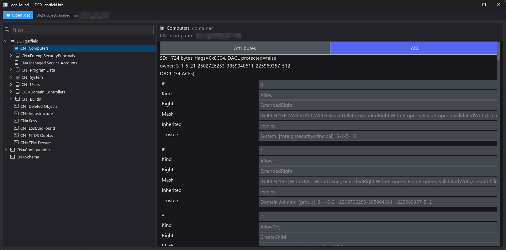

# LdapHound

**English** | [简体中文](./README.zh-CN.md)

> Deep-dive parser for Active Directory **Security Descriptors** — read
> ADExplorer `.dat` snapshots or `ldapsearch` LDIF dumps offline, no live
> domain connection required. Ships with both a GUI and a CLI.



## What it does

LdapHound reads the binary `.dat` snapshots exported by Sysinternals
ADExplorer and reconstructs each object's **nTSecurityDescriptor** in full
detail: owner/group SIDs, control flags, DACL/SACL, and every ACE. The
Security Descriptor is the core of AD access control — LdapHound turns the
raw self-relative binary blob into a human-readable, auditable structure.

- Decodes every common ACE type: `ACCESS_ALLOWED`, `ACCESS_DENIED`,
  `ACCESS_ALLOWED_OBJECT`, `ACCESS_DENIED_OBJECT`, plus the raw
  `SYSTEM_AUDIT` family
- Unpacks the AccessMask bitfield (GenericAll / WriteDACL / WriteOwner /
  ExtendedRight / WriteProperty / ...) and maps extended-right GUIDs to
  names — DCSync, WriteMember, WriteSPN, UserForceChangePassword,
  WriteAllowedToAct (RBCD), Enroll, etc.
- Resolves ACE trustee SIDs back to the snapshot object's
  `sAMAccountName` / display name so permissions read as
  "Administrators [group]" rather than a bare SID
- Surfaces inherited-vs-explicit and DACL-protected flags at a glance

Beyond SD parsing, LdapHound also reconstructs the directory tree
(Domain / Configuration / Schema naming contexts), decodes the common
`ads_type` attributes (String / Integer / OctetString / SID / GUID /
UTCTime), and supports RFC 4515 LDAP search filters
(`(&(objectCategory=Person)(objectClass=User))`, `(sAMAccountName=j*)`).

The same views work on `ldapsearch` query results: save the LDIF output to
a file and open it — see [Importing `ldapsearch` results](#importing-ldapsearch-results-ldif).

## Importing `ldapsearch` results (LDIF)

LdapHound opens LDIF files written by OpenLDAP's `ldapsearch` (and
compatible tools) with the same tree, attribute and ACL views. The input
format is auto-detected, so `.dat` snapshots and LDIF dumps go through the
same GUI **Open…** dialog or the same CLI invocation.

### Recommended query

```bash
ldapsearch -o ldif-wrap=no -E pr=1000/noprompt \
  -x -H ldap://dc01.corp.local -D 'CORP\jdoe' -W \
  -b 'DC=corp,DC=local' \
  '(objectClass=*)' '*' nTSecurityDescriptor \
  > corp.ldif
```

Why these flags matter:

| Flag | Why |
| --- | --- |
| `-E pr=1000/noprompt` | **Required.** AD caps one results page at 1000 entries; paged retrieval is the only way to get everything. |
| `'*' nTSecurityDescriptor` | `*` fetches all user attributes; `nTSecurityDescriptor` must be requested explicitly or the ACL tab stays empty. |
| `-o ldif-wrap=no` | Keeps multi-KB security descriptors on one line. Optional — folded lines are accepted too. |
| `-t` / `-T` | **Don't use.** They write binary attributes to temp files instead of inline base64, which the importer can't read. |

Binary attributes (`objectSid`, `objectGUID`, `nTSecurityDescriptor`, ...)
arrive base64-encoded (`objectSid:: AQAA...`) and are decoded automatically.
If security descriptors come back empty, the bind account lacks
`READ_CONTROL` on those objects.

For large domains, requesting only the attributes LdapHound actually uses
is much faster on the wire:

```bash
ldapsearch -o ldif-wrap=no -E pr=1000/noprompt \
  -x -H ldap://dc01.corp.local -D 'CORP\jdoe' -W \
  -b 'DC=corp,DC=local' \
  '(objectClass=*)' \
  objectClass cn name sAMAccountName member memberOf objectSid objectGUID nTSecurityDescriptor \
  > corp.ldif
```

That attribute set covers the tree layout (`objectClass` + the always-present
`dn:`), trustee resolution (`objectSid` + `sAMAccountName`/`name`) and the
ACL tab (`nTSecurityDescriptor`); `member`/`memberOf` are optional extras.

Smaller scopes work identically — restrict with `-b` or an LDAP filter:

```bash
# Only user and computer objects
... -b 'DC=corp,DC=local' '(|(objectCategory=Person)(objectCategory=Computer))' ...
# Only one OU
... -b 'OU=Sales,DC=corp,DC=local' '(objectClass=*)' ...
```

The Configuration and Schema naming contexts can be dumped separately and
concatenated into the same file — LDIF records are self-describing:

```bash
ldapsearch ... -b 'CN=Configuration,DC=corp,DC=local' '(objectClass=*)' '*' nTSecurityDescriptor >> corp.ldif
```

Kerberos (`-Y GSSAPI` instead of `-x -D ... -W`) and LDAPS
(`ldaps://dc01.corp.local` or `-ZZ`) work as usual.

Then inspect it like any snapshot:

```bash
ldaphound-cli corp.ldif --type user
ldaphound-cli corp.ldif --object "CN=Administrator,CN=Users,DC=corp,DC=local"
```

## AI relationship-graph analysis

LdapHound can expose a bounded, read-only graph to an OpenAI model through
the Responses API's [function calling](https://developers.openai.com/api/docs/guides/function-calling)
flow. The model can search nodes, inspect a node, traverse neighbors, find
paths, and list high-risk relationships without receiving the raw snapshot.

The graph currently models:

- directory containment and group membership (including `primaryGroupID`)
- `manager` / `managedBy`, object ownership, GPO links and SID History
- allow/deny ACL relationships with right, mask and inheritance metadata
- resource-based constrained delegation and constrained-delegation SPNs

The CLI reads its API key from the process environment:

```bash
export OPENAI_API_KEY='...'
# Optional; defaults to gpt-5.6
export OPENAI_MODEL='gpt-5.6'

ldaphound-cli snapshot.dat --ai "Find high-impact paths to privileged groups"
ldaphound-cli snapshot.dat --ai "Analyze this account" --ai-focus 'CORP\\jdoe'
```

The GUI exposes the same workflow in the selected object's **AI Analysis**
tab. Use **AI settings** in the top toolbar to configure the Responses API
base URL, model ID, and a masked API key. A blank GUI key uses
`OPENAI_API_KEY`; an entered key is held only for the current process and is
never written to disk. No provider request is made until **Analyze graph** is
clicked.

### Privacy boundary

- Requests use `store: false`; the API key is never written to files, graph
  exports, prompts, or logs. A GUI-entered key exists only in masked process
  memory for the current session.
- Raw `.dat`/LDIF files, raw security descriptors, binary values, and
  arbitrary LDAP attributes are never uploaded. Tools return only bounded
  identity, security-posture and relationship fields.
- LDAP values are treated as untrusted data so text inside an attribute
  cannot become model instructions.
- You can inspect exactly what the AI tools are able to expose before making
  a request:

```bash
ldaphound-cli snapshot.dat --export-ai-graph ai-graph.json
```

Names, DNs, SIDs, selected security attributes and graph relationships are
still directory data and will be transmitted when the model requests them.
Use an approved API project and data-handling policy for your environment.

## Usage — GUI

```bash
cargo run --release -p ldaphound-gui
```

- Top menu bar: **Open…** — ADExplorer `.dat` snapshot or LDAP/LDIF dump
  (format auto-detected)
- Left sidebar: recursive tree over the three naming contexts, with
  expand/collapse, substring filter, per-type icons
- Main pane: object TitleBar (icon + name + class + DN), then two tabs
  - **Attributes** — sorted name|value list
  - **ACL** — each ACE rendered as its own card
    (#/Kind/Right/Mask/Inherited/Trustee). Long values scroll horizontally;
    in-card fields are drag-selectable + Ctrl+C-able. Selecting a card
    surfaces a Copy button for the whole row.
- Draggable divider between sidebar and main pane

## Usage — CLI

```bash
# List every object (ldapsearch-style output); input may be an ADExplorer
# .dat snapshot or an ldapsearch LDIF dump (auto-detected)
ldaphound-cli snapshot.dat
ldaphound-cli corp.ldif

# AI analysis through a privacy-bounded relationship graph
ldaphound-cli snapshot.dat --ai "Find dangerous delegated permissions"

# Inspect one object's full Security Descriptor + ACL breakdown
ldaphound-cli snapshot.dat --object "CN=Administrator,CN=Users,DC=x"
ldaphound-cli snapshot.dat --object S-1-5-21-...-519

# Filter by coarse type (repeatable, OR-combined)
ldaphound-cli snapshot.dat --type user --type computer

# LDAP filter (AND-combined with --type)
ldaphound-cli snapshot.dat --filter '(&(objectCategory=Person)(objectClass=User))'
ldaphound-cli snapshot.dat --filter '(sAMAccountName=j*)'
```

Output is ldapsearch-style (`dn:` + `attribute: value`), pipe-friendly.

## Build & test

Requires Rust 1.85+ (edition 2024).

```bash
cargo build --release
cargo test  -p ldaphound-core --lib
```

## Background

The ADExplorer `.dat` format is undocumented and proprietary. Format
knowledge derives from the reverse engineering in
[`ADExplorerSnapshot.py`](https://github.com/c3c/ADExplorerSnapshot.py)
(MIT, by c3c), cross-referenced with
[MS-DTYP](https://learn.microsoft.com/en-us/openspecs/windows_protocols/ms-dtyp/).
The parser is a clean-room implementation and does not incorporate code
from either source. Full format spec with field-offset tables and
calibration data: [`docs/snapshot-format.md`](./docs/snapshot-format.md).

## License

MIT. The bundled Bootstrap Icons font retains its own MIT license.
